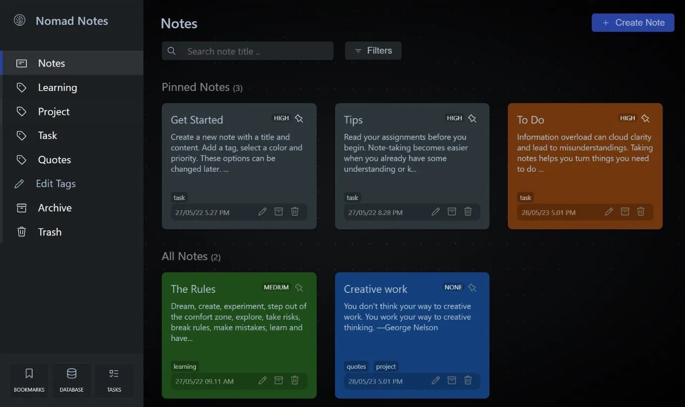

<p align="center">  
  <a href="https://github.com/gigamaster/nomad-notes">
  </a>
  
</p>

<h2 align="center">
<br />
///// — CODEMO DIGITAL NOMAD NOTES — \\\\\
<br /><br />
</h1>

<p align="center"><br />Digital Nomad Notes to easily create and organize your locally stored notes.<br /><br /></p>

[](https://gigamaster.github.io/nomad-notes/)

## Overview

**Why the React.js hype? Is it worth learning React in 2024?**

React was first deployed on Facebook's News Feed in 2011, and then integrated into Instagram in 2012. In May 2013, at JSConf US, the project was officially made open source marking a major turning point in its adoption and growth. In fact, Facebook had to promote React to attract funding, and to get their technology improved by **unpaid developers** who are still trying to solve problems that only exist because of React. Mostly out of ignorance, but also because of the promise of getting a job at Facebook, which sooner or later they realize it was nothing else than a false promise. 

>The new generation of developers entering the market lacks critical thinking courses, by political decision and strategy of the BigTech industry, this generation is subject to a strong injunction of conformity and obedience to media influence and to follow trends.

React is completely contrary to existing web technologies, so more and more libraries are written to make things work in React that would already work without it. React is also not the fastest, nor a convenient way to create components for web applications.

- React SPA requires more complex client-side scripting 
- does not work well for content-heavy applications
- security concerns 
- not compatible with all browsers and devices
- difficult to debug and troubleshoot
- accessibility concerns for users with disabilities
- not suitable for all types of applications

**Tech layoffs worldwide**

- Feb 2024. As of December 2023, more than 262,000 employees at tech companies worldwide had been laid off during the year across more than 1,180 firms.
- Sept 2024. Technology companies worldwide saw a significant reduction in their workforce in the first quarter of 2024, with over 57 thousand employees being laid off.

## Pre-requisites

If you're already familiar with JavaScript, React and React Native, then you'll be able to get moving quickly! If not, it is highly recommend to gain some basic knowledge first e.g. [Learn React](https://react.dev/learn) then come back here when you're done.

## Features

<table>
  <tr>
    <th width="274px">Notes Management</th>
    <th width="274px">Archive and trash</th>
    <th width="274px">Labels Management</th>
  </tr>
  <tr>
    <td valign="top">
      localStorage<br>
      Color note<br>
      Crud<br>
      Quill WYSIWYG editor<br>
      Tags<br>
      Text and image
    </td>
    <td valign="top">
      Archive notes<br>
      Restore notes<br>
      Permanently delete
    </td>
    <td valign="top">
      Create new tags<br>
      Note with multiple tags
    </td>
  </tr>
    <tr>
    <th>Filter</th>
    <th>Localstorage</th>
    <th>Search</th>
  </tr>
  <tr>
    <td>
      Sort by priority<br>
      Sort by date
    </td>
    <td>
      Todo - export json<br>
      Todo - import json
    </td>
    <td>
      Search Notes by Title<br>
      Todo - Search Note content
    </td>
  </tr>
</table>

## 🛠️ ToDo

- refactor code to [react-router-dom v6](https://reactrouter.com/en/main/start/overview)
- Export file json
- Import local file json
- localStorage alternatives  
to enhance security and efficient data storage

## Run it locally

Recommend version Node v18.18.0 (LTS)  
You can use [nvm](https://github.com/creationix/nvm#installation) (macOS/Linux) or [nvm-windows](https://github.com/coreybutler/nvm-windows#node-version-manager-nvm-for-windows) to switch Node versions between different projects.

### Dependencies

- React Js
- Redux Toolkit
- Redux-persist
- React Router
- React-quill-new
- React-toastify
- Styled Components

Inside the **nomad-notes** project, you can run some built-in commands.

### `npm install`

```sh
npm install
```

## `npm start`

Runs the app in development mode. Open [http://localhost:3000](http://localhost:3000) to view it in the browser.  
The page will automatically reload if you make changes to the code.<br>
You will see the build errors and lint warnings in the console.

```sh
npm start
```

## `npm test`

Runs the test watcher in an interactive mode.<br>
By default, runs tests related to files changed since the last commit.

[Read more about testing.](https://facebook.github.io/create-react-app/docs/running-tests)

## `npm run build`

It will create a directory called `build` inside the current folder with a production build of your app.  
Inside the build/static directory will be your JavaScript and CSS files.  
Each filename inside of `build/static` will contain a unique hash of the file contents.  
This hash in the file name enables long term caching techniques, ready to be deployed.

```sh
npm build
```

### `npm run format`

Run Prettier to automatically format the code.

```sh
npm run format
```

### `npm run predeploy`

Run build ready to deploy.

### `npm run predeploy`

Deploy the build to GitHub Pages.


## Deploy to GitHub Pages

⚠️ 🚧 **React router deployment to GitHub Pages** 🚧 ⚠️ 

Among other issues and drawbacks of React Single Page Applications, often referred to as SPAs, is the fact that they are not natively supported by GitHub Pages.
A page reload for a url like example.com/foo, where /foo is a frontend route, the GitHub Pages server returns 404 because it expects these routes as individual static files.

**The step below is important!**  
If you skip it, your app will not deploy correctly.

1 - Open the file `package.json` and modify the homepage field for your project:

`"homepage": "https://myusername.github.io/my-app"`

or for a GitHub user page:

`"homepage": "https://myusername.github.io"`

or for a custom domain page:

`"homepage": "https://mywebsite.com"`

The React App uses the homepage field to determine the root URL in the built HTML file.  

2 - Open `/src/App.js` and modify the router basename to match your project:

`<Router basename="/nomad-notes">`

3 - Open `/public/404.html` and modify the path segments to keep:

`var pathSegmentsToKeep = 1;`

For a Project Pages site, and NOT using a custom domain.  
This will only replace the route part of the path.  
Otherwise, leave pathSegmentsToKeep = 0.  

## Browsers list

Share target browsers between different front-end tools, like Autoprefixer, Stylelint and babel-preset-env. Get a list :

```sh
npx browserslist`
```

[Learn more about Browsers list](https://github.com/browserslist/browserslist)


## License

MIT License

Copyright (c) 2024

Permission is hereby granted, free of charge, to any person obtaining a copy
of this software and associated documentation files (the "Software"), to deal
in the Software without restriction, including without limitation the rights
to use, copy, modify, merge, publish, distribute, sublicense, and/or sell
copies of the Software, and to permit persons to whom the Software is
furnished to do so, subject to the following conditions:

The above copyright notice and this permission notice shall be included in all
copies or substantial portions of the Software.

THE SOFTWARE IS PROVIDED "AS IS", WITHOUT WARRANTY OF ANY KIND, EXPRESS OR
IMPLIED, INCLUDING BUT NOT LIMITED TO THE WARRANTIES OF MERCHANTABILITY,
FITNESS FOR A PARTICULAR PURPOSE AND NONINFRINGEMENT. IN NO EVENT SHALL THE
AUTHORS OR COPYRIGHT HOLDERS BE LIABLE FOR ANY CLAIM, DAMAGES OR OTHER
LIABILITY, WHETHER IN AN ACTION OF CONTRACT, TORT OR OTHERWISE, ARISING FROM,
OUT OF OR IN CONNECTION WITH THE SOFTWARE OR THE USE OR OTHER DEALINGS IN THE
SOFTWARE.
